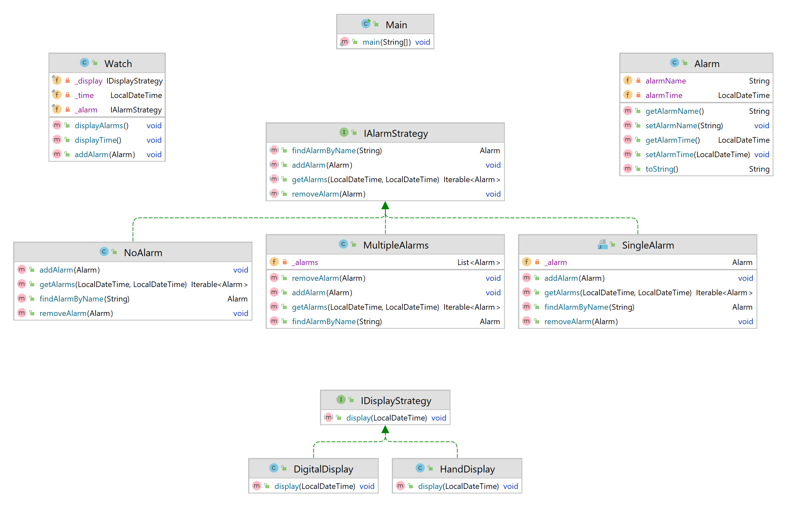

# strategy
Strategy Pattern in different languages

In strategy Pattern we define a family of algorithms, encapsulate each one of them, and make them interchangeable.

In practice, define interfaces to represent the algorithms and implement those interfaces in concrete classes as needed.

Example:

Model Watches with different behaviors:
display: displays the time. It can be hands/digits/hybrid
alarm: set/get alarms. It can be simple/multiple/none

